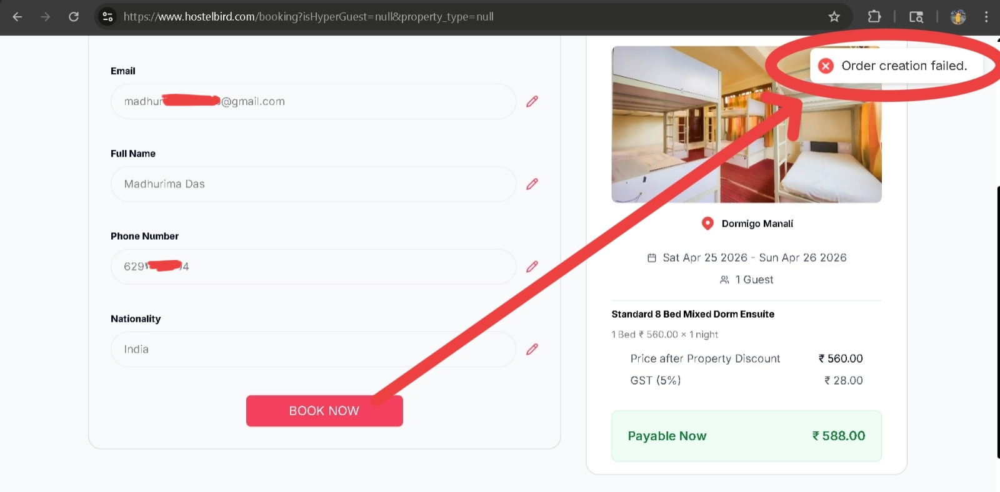
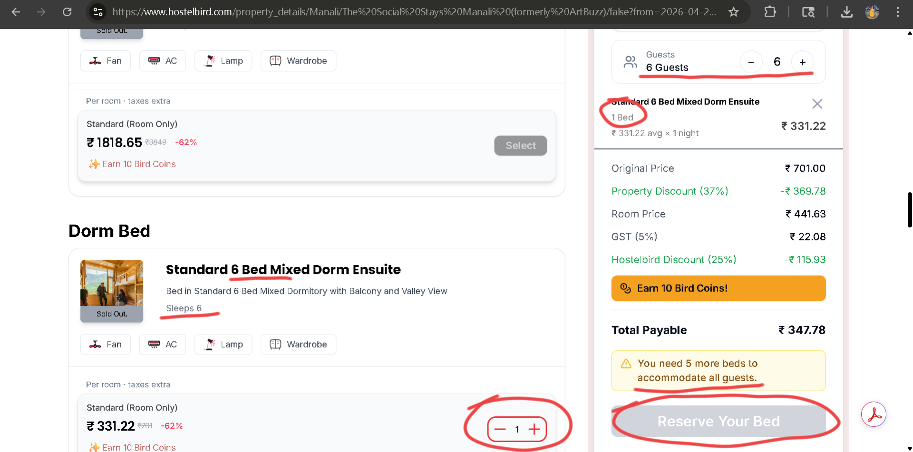
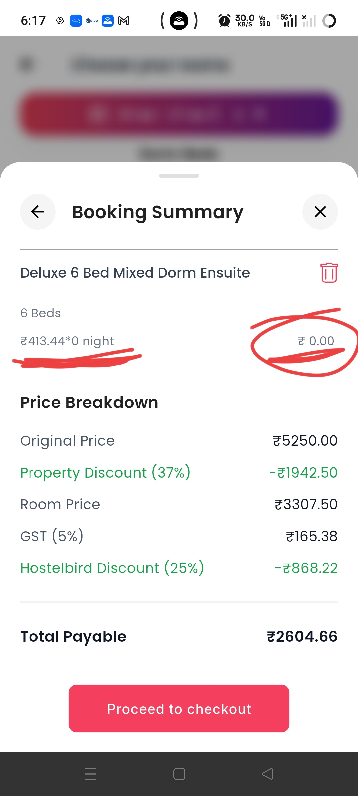

# Hostelbird Hackathon Submission  
### Build It. Break It. Ship It.

**Submitted by:** Madhurima Das  
**College:** Government College of Engineering and Ceramic Technology  

---

## Overview
During my exploration of the Hostelbird web platform, I discovered **4 critical issues** that severely degrade the user experience, cause direct revenue loss, and prevent users from completing their core journey—booking a stay.

These issues fall under three root problems:
1. **Broken booking flow** (Order creation failed)
2. **Inconsistent validation** (Unrealistic inputs allowed)
3. **Mismatch between UI and backend logic** (Capacity v/s booking inconsistencies)

Below is a detailed breakdown of each problem, why it matters, the proposed solution, and the proof of implementation:

---

## 1. Booking Failure After CTA

### Problem
After completing all booking steps and clicking **"Book Now"**, the system throws:
> **"Order creation failed"**

### What I Observed 
I selected a property, filled in all required details, and proceeded to the final step.
On clicking the CTA, the booking failed without explanation. 

---

### Evidence:
This clearly shows that the booking fails even after valid input.
<p align="center">
  
</p>

---

### Why It Matters
This indicates a failure at the system/API level, directly blocking successful order creation.
- Occurs at **highest user intent stage**
- No retry or recovery option
- Leads to **direct booking failure + trust loss**

---

### Solution:
- Handle API failures properly
- Provide retry mechanism
- Show meaningful error messages

---

### Proof of Implementation:

```jsx
const handleBooking = async () => {
  try {
    setApiError('');
    setLoading(true);

    const response = await createOrder();

    if (!response.success) {
      throw new Error(response.message || "Order creation failed");
    }

    setBooked(true);

  } catch (error) {
    setApiError(error.message || "Something went wrong. Please try again.");

  } finally {
    setLoading(false);
  }
};

```
---

## 2. Confusing Capacity Representation & Validation Flow

### Problem Identified:
There is a mismatch between how room capacity is presented in the UI and how the booking logic is actually enforced.

---

### What I Observed:
The room is labeled as **“Sleeps 6”**, which suggests that selecting the room should accommodate up to 6 guests.

However, in practice:
- Each guest requires selecting an individual bed  
- Beds are **not automatically assigned** based on guest count  

In my testing:
- I selected **6 guests**
- Only **1 bed was selected by default**
- The system showed a warning:  
  > “You need 5 more beds to accommodate all guests”

Although the system correctly blocks booking (CTA disabled), the flow is still confusing because:
- Capacity is communicated at the **room level**
- Validation is enforced at the **bed level**

---

### Evidence:
It demonstrates that users must manually match beds with guests despite the room indicating full capacity:
<p align="center">
  
</p>

---

### Why It Matters:
- Creates confusion between **room capacity vs bed selection**
- Increases cognitive load for users  
- Slows down the booking process  
- Can lead to drop-offs due to unclear interaction

The system logic is correct, but the way it is communicated creates confusion for users.

---

### Solution:
- Clearly indicate **“per-bed booking”** in the UI  
- Auto-select required number of beds based on guest count  
- Show real-time feedback like:  
  > “Beds required: 6 | Beds selected: 1”
- Reduce manual effort and make the flow more intuitive

--- 

### Proof of Implementation:

```jsx
const totalGuests = guests.adults + guests.children;

const totalBeds = Object.values(selectedRooms)
  .reduce((sum, qty) => sum + qty, 0);

const unassignedGuests = Math.max(0, totalGuests - totalBeds);

// UI feedback
{unassignedGuests > 0 && (
  <p>You need {unassignedGuests} more bed{unassignedGuests > 1 ? 's' : ''} to accommodate all guests.</p>
)}

```
---

## 3. Guest Validation Failure

### Problem Identified:
The guest selection component allows users to increase the guest count without any upper limit.

---

### What I Observed:
While testing, I was able to continuously click the "+" button and increase the guest count to unrealistic values (20+ guests) without any warning or restriction.

---

### Evidence:
The following demo clearly shows that users can increase the guest count without any upper limit:
[watch demo](https://drive.google.com/file/d/11myDdft5yIJxeJtWyjvK0O_O0uvAYRTh/view?usp=drive_link)

---

### Why It Matters:
- Allows **unrealistic booking scenarios** that don’t reflect actual usage  
- Can lead to **unexpected backend behavior** if large values are not properly handled  
- Creates a **poor user experience**, as the system appears unbounded and inconsistent  

---

### Solution:
- Set a realistic upper limit for guests (e.g., 10–15 per booking)  
- Provide a clear alternative for larger groups:
  > “For group bookings, please contact support”  
- Disable further increment once the limit is reached  

---

### Proof of Implementation:

```jsx
const MAX_GUESTS_PER_BOOKING = 15;
const GuestSelector = ({ currentGuests, onChange }) => {

  const handleIncrement = () => {
    if (currentGuests >= MAX_GUESTS_PER_BOOKING) return;

    onChange(currentGuests + 1);
  };

  const handleDecrement = () => {
    if (currentGuests <= 1) return;

    onChange(currentGuests - 1);
  };

  return (
    <div className="flex items-center space-x-4">
      <button 
        onClick={handleDecrement} 
        disabled={currentGuests <= 1}
      >
        -
      </button>

      <span>{currentGuests}</span>

      <button 
        onClick={handleIncrement} 
        disabled={currentGuests >= MAX_GUESTS_PER_BOOKING}
      >
        +
      </button>

      {currentGuests >= MAX_GUESTS_PER_BOOKING && (
        <p className="text-sm text-gray-500">
          For group bookings, please contact support.
        </p>
      )}
    </div>
  );
};

```

## 4. Pricing Calculation Inconsistency

### Problem Identified:
The booking summary shows inconsistent pricing calculations, where the number of nights is displayed as 0, but the total payable amount is still calculated.

---

### What I Observed:
In the booking summary:
- It shows:  
  > ₹413.44 × 0 night = ₹0.00  
- However:
  - A full price breakdown is still displayed  
  - Total payable amount is shown as ₹2604.66  

This creates a direct contradiction between displayed calculation and final billing.
---

### Evidence:
The following link shows that the system displays **0 nights** while still calculating and showing a non-zero total payable amount:
<p align="center">
  
</p>
---

### Why It Matters:
- Creates confusion in pricing logic  
- Reduces trust in billing accuracy  
- Users may hesitate to proceed due to unclear cost calculation  

This inconsistency directly impacts user trust, as pricing appears unreliable and misleading.

---

### Solution:
- Ensure correct night calculation before pricing  
- Hide or block pricing if input is invalid  
- Maintain consistency between:
  - nights  
  - price calculation  
  - total payable  

---

### Proof of Implementation:

```javascript

const calculateNights = (checkIn, checkOut) => {
  const diff = new Date(checkOut) - new Date(checkIn);
  return Math.max(1, diff / (1000 * 60 * 60 * 24));
};

const calculateTotal = (pricePerNight, nights, beds) => {
  if (nights <= 0) {
    throw new Error("Invalid date selection");
  }

  return pricePerNight * nights * beds;
};

if (nights <= 0) {
  return (
    <p className="text-red-500">
      Please select valid check-in and check-out dates.
    </p>
  );
}

```
---

## Repository:

All issues identified in this submission have been implemented and tested in the repository.
View the complete project here:  
[Github Repo Link](https://github.com/mds06f/hostelbird-bugfix-case-study)

---
## Final Thoughts

The identified issues highlight key gaps in booking reliability, validation logic, and pricing consistency.

Addressing these problems will:
- Improve booking success rate
- Reduce user confusion
- Increase trust in pricing and system behavior

Overall, the focus is on aligning system logic with user expectations while ensuring a smooth and reliable booking experience.
